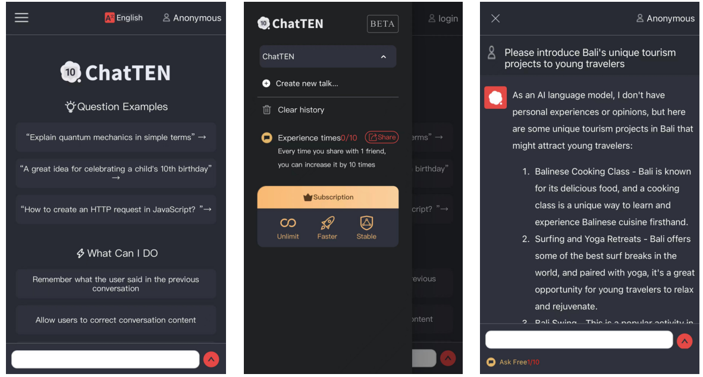

# 10. 基于协议的产品样例

SAMA协议的应用开发场景有AI聊天，隐私社交、博客、交易所、自媒体、设计作品等。\
ChatTEN是基于SAMA协议开发的分布式AI应用，用户可开箱即用，一键与ChatGPT等AI对话，同时保证了用户与AI的聊天记录不被窃取，实现了安全上网。\

### [SAMA协议AI聊天应用](http://hi.chattop.club/)  

<figure><figcaption></figcaption></figure>
