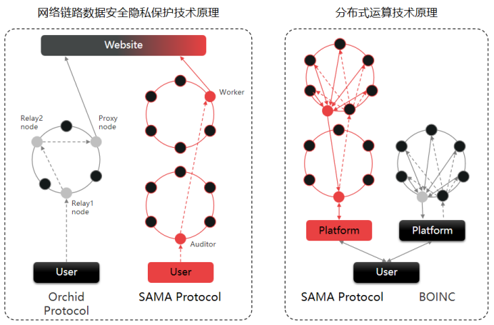

# 3 SAMA协议的运行原理
 
&emsp;&ensp;用户直接访问互联网的方式将完全暴露用户的IP地址和访问的数据内容，用户的隐私将得不到保证。因此保证用户隐私的互联网协议被大力研发和广泛应用。 

&emsp;&ensp;SAMA协议的网络链路数据安全隐私保护技术原理如上图所示，SAMA协议采用双环分布式网络对用户数据进行加密隔离，充分保障用户数据隐私安全。用户采用SAMA协议上网，那么用户访问请求会先传输到审计网络的某个节点，审计网络节点再将请求传输到工作网络的某个节点，之后工作网络节点再将请求传输到互联网上。互联网返回访问请求的数据，同样需要经过工作网络返回到审计网络，再返回给用户。这种双环分布式网络机制不仅在数据传输中通过用户、审计节点、工作节点公私钥配对加解密，同时通过两个分布式网络隔离保护用户数据隐私。 

&emsp;&ensp;兰花协议是以太坊的Layer2项目，基于ETH网络运行，性能很低，并且用户完成交易的时候，需要支付昂贵的Eth Gas费用，因此用户的服务体验较差。 

&emsp;&ensp;分布式计算是利用互联网上的计算机的中央处理器的闲置处理能力来解决大型计算问题的一种计算科学。分布式计算将应用分解成许多小的部分，分配给多台计算机进行处理。这样可以节约整体计算时间，大大提高计算效率。 

&emsp;&ensp;BOINC（算力地球）是目前的主流分布式计算平台之一，由加州大学伯克利分校计算机学系发展出的分布式计算系统。计算网络由全球志愿者和爱好者提供的计算资源构成。用户需要使用Python编写任务提交到BOINC算力市场进行任务拆解分配，然后由分布式网络中的计算节点完成计算，再汇聚到算力市场聚合计算结果。 

&emsp;&ensp;SAMA协议通过中间件层提供算力调度服务。用户只需要通过算力调度中台提交计算任务，调度中台通过任务拆解成多个子任务，分配到SAMA审计网络中的审计节点将任务分配给工作网络中的工作节点，工作节点完成子任务计算，通过审计节点汇聚到算力调度中台进行聚合计算结果。 
