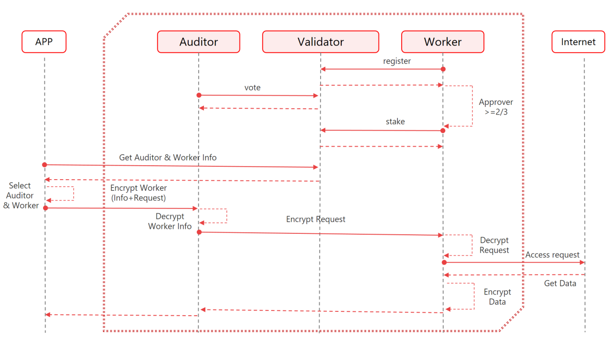

# 4.1. 加密流程

<figure><figcaption></figcaption></figure>

\
SAMA隐私协议将一个分布式网络构建成了两个逻辑上相互独立的分片网络，这两个相互独立的分片网络是审计（Auditor）网络和工作（Worker）网络。正是这两个网络中节点的加密和解密过程保证了用户数据的隐私。

下面的10个步骤展示的是审计节点和工作节点是如何服务应用用户访问互联网。\

**Step 1**    [审计节点](../2.-gai-shu.md#ji-ben-de-gai-nian)和[工作节点](../2.-gai-shu.md#ji-ben-de-gai-nian)加入SAMA网络都需要通过注册和审批流程，审计节点和工作节点注册流程相同。节点的注册流程如下：

> * 想要成为工作节点和审计节点的备选节点必须先加入雪崩子网。
> * 各备选节点向雪崩子链发起注册申请。
> * 正在工作的审计节点用户收到注册事件后，在事件有效期内对工作网络的备选节点信息进行审核后进行投票。如果支持备选节点操作的投票数超过审计节点用户投票数的三分之二，则允许选中的工作网络节点在规定时间内质押成为正式的工作网络节点向用户提供服务。
> * 同理，正在工作的审计节点用户收到注册事件后，在事件有效期内对审计节点网络的备选节点信息进行审核后进行投票。如果支持备选节点操作的投票数超过审计节点用户投票数的三分之二，则允许选中的审计网络节点在规定时间内质押成为正式的审计网络节点向用户提供服务。\
>

**Step 2**    用户看不到审记节点和工作节点信息，但是可以通过APP选择国家，命令行或者网络协议。

**Step 3**    用户查看服务器所在国家等信息，然后根据自己的喜好选择为自己服务的审计节点和工作节点。

**Step 4**    APP对用户选择的工作点信息和用户数据进行加密,先选取对应的公钥结合APP用户工作私钥通过ECDH算法得到加密密码，并通过aes-128-cfb和chacha20-ietf-poly1305算法完成加密

> * 工作节点信息加密： 使用被选择的审计节点的工作公钥和APP工作私钥产生密码，并通过chacha20-ietf-poly1305算法加密。\
>
> * Data加密： 使用被选择的工作节点的工作公钥和APP工作私钥产生密码,并通过aes-128-cfb算法加密。\
>

**Step 5**    审计节点收到APP推送数据后，通过自身工作私钥和APP公钥，对工作节点信息进行解密。

**Step 6**    审计节点将剩余加密数据原封不动的推送给工作节点。

**Step 7**    工作节点通过自身工作私钥结合APP公钥，对用户加密数据进行解密，然后进行互联网访问。

**Step 8**    互联网返回数据后，工作节点通过相同的加密流程，对返回数据加密后推送给审计节点。

**Step 9**    审计节点找到对应的APP链接，把数据推送给APP 。

**Step 10**    APP解密后发送给用户进程完成整个访问流程。
