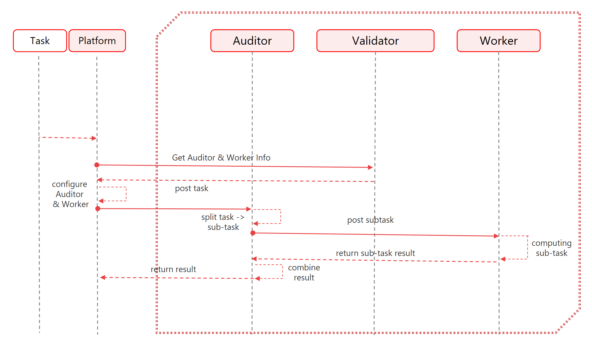

# 4.2. 运算流程

<figure><figcaption></figcaption></figure>

\
Platform SE中间件通过SAMA链上获取分布式网络的所有结点，工作量网络上逻辑独立的分片网络是审计网络和工作网络。审计网络通过对计算子任务的路由派发到工作网络的工作者进行计算，最终工作者运算完成后把子结果反馈给审计者，然后通过中间件进行聚合结果。

下面的6个步骤展示的是审计节点和工作节点的整个预算过程。\

**Step 1**    客户向中间件平台呈递计算算法和任务；

**Step 2**    中间件平台对当前算法进行计算费用评估；

**Setp 3**    客户锁定费用之后，任务开始被投递到审计者节点；

**Step 4**    审计者按照相应配置会对复杂任务进行拆分变成子任务；

**Step 5**    子任务会被平台派发给不同相应的工作者，工作者负责运算结果；

**Step 6**    工作者计算出结果后返回给审计者，平台通过审计者聚合结果得出最终的运算结果。
