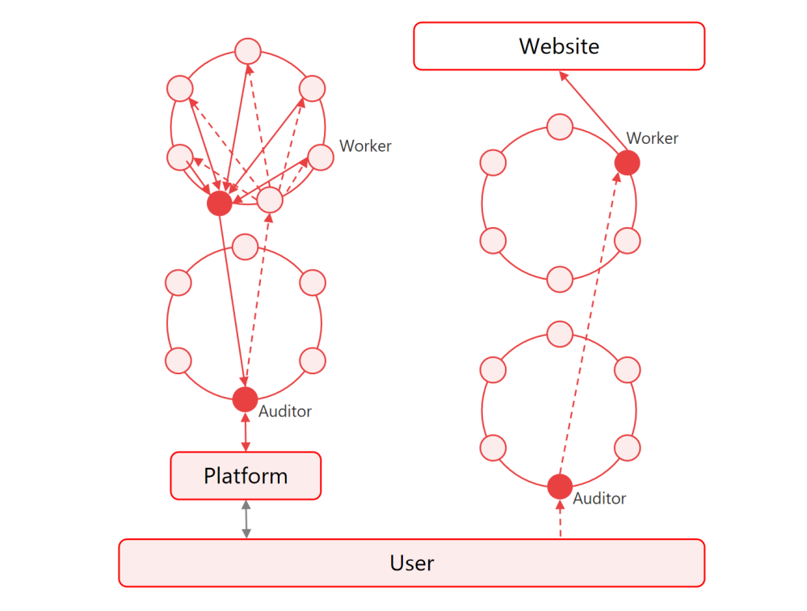

# 4. SAMA网络工作原理

<figure><figcaption></figcaption></figure>

\
用户直接访问互联网的方式将完全暴露用户的IP地址和访问的数据内容，用户的隐私将得不到保证。因此保证用户隐私的互联网协议被大力研发和广泛应用。

SAMA协议的网络链路数据安全隐私保护技术原理如上图所示，SAMA协议采用双环分布式网络对用户数据进行加密隔离，充分保障用户数据隐私安全。

在工作量网络中，审计节点能够看到应用用户的IP、地理信息，访问网络行为等信息，但无法查看应用用户访问互联网的具体的内容。数据路由到工作节点，能看到用户访问的内容，但无法看到具体的用户信息。这种安全隔离设计可以保护用户的隐私，防止数据泄露和滥用；同时这样设计也使得SAMA协议可以轻松应对这些业务数据的高并发，解决大规模用户访问的需求；进一步也提高了网络的可扩展性和可靠性。通过这种创新的网络架构和安全隔离设计，SAMA协议为用户提供了更加安全、快速和可靠的互联网访问体验

客户通过Platform SE中间件进行计算任务的投递，SE会对计算算法进行评估，完成评估后会返回预算的报价，最终由客户确定是否派发任务去进行计算。

